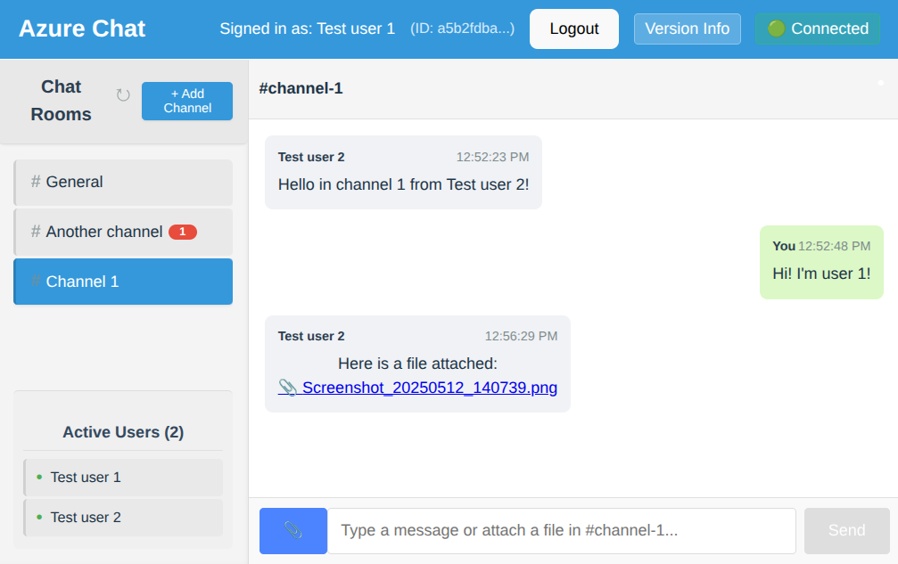

# Azure Chat Service

A simple, real-time chat service built on Azure cloud infrastructure.

  

## Overview

The main purpose of this project is to serve as a learning and exploration platform for Azure cloud services such as:
* Cosmos DB (No-SQL database)
* Blob storage
* App Service
* Event Grid (Planned)
* SignalR (Planned)
* Functions (Planned)

## Structure

| Folder       | Description                                |
|--------------|--------------------------------------------|
| `/backend`   | Python FastAPI backend application         |
| `/docs`      | Project documentation                     |
| `/frontend`  | Node.js/Vite TypeScript frontend           |
| `/infrastructure` | Terraform base + Terraform module for Azure services |

## Getting Started

See the documentation in the respective folders for setup instructions:

- [Backend Documentation](backend/README.md)
- [Frontend Documentation](frontend/README.md)
- [Infrastructure Documentation](docs/infrastructure.md)
- [Architecture Documentation](docs/architecture.md)

## Limitations

As this is a learning project, it has several limitations:

- **No Authentication**: The application uses simple username input without proper authentication.
- **Limited Security**: Security best practices are not fully implemented.
- **No Testing**: The project lacks unit tests, integration tests, and end-to-end tests.
- **Basic Error Handling**: Error handling is minimal and not production-ready.
- **No Role-Based Access**: Since many users lack full user and permission management in Azure, we use connection strings and user/password for authentication. In a production environment, role-based access and SPNs should be used.

## Note on Docker and Container Development

This project does not cover Docker or basic container development. If you are new to these topics, please see the "DevOps Lab Kit" for an introduction:

[DevOps Lab Kit](https://github.com/sandnabba/devops-lab-kit)

## To-Do

* Investigate SignalR service.
* Add email support.
* Add proper user registration (register email + username) - Persistent user database.
  * Here is where email sending comes in - User email confirmation.
* Enable user-to-user messaging.
* Provide clear "Getting Started" instructions:
  * Define `local.env` and `terraform.tfvars`.